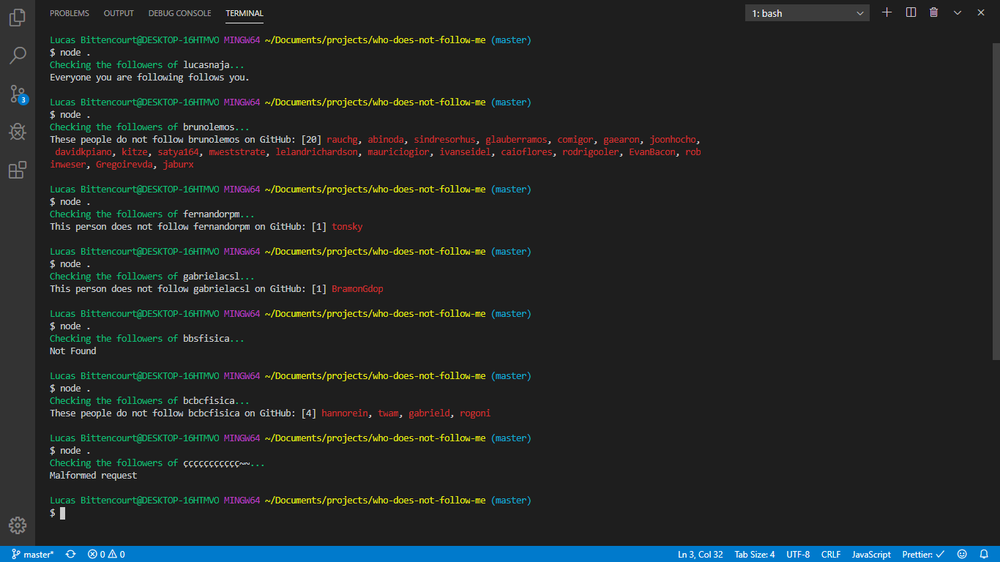

# Who does not follow me

## Description

A Node.js script to check who does not follow you on GitHub. (based on your following and followers)

## How to use

- clone this repo and type `cd who-does-not-follow-me/`
- type `yarn` to install its dependencies
- change the `username` on `src/index.js` to send the request by this username.
- type `node .` or `yarn start` to run the script.

## Image

## Author

| [ @lucasnaja](https://github.com/lucasnaja) |
| :---: |
